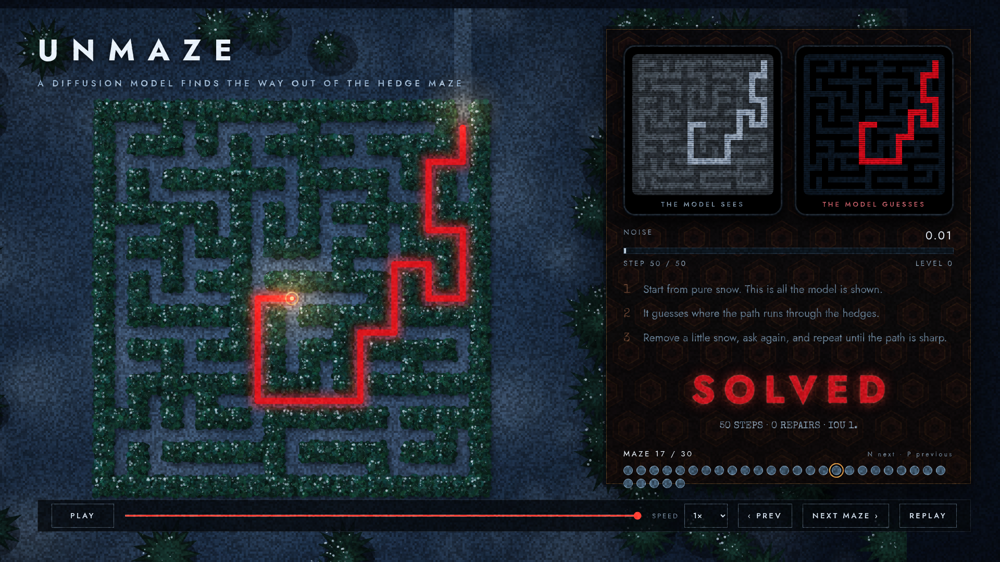
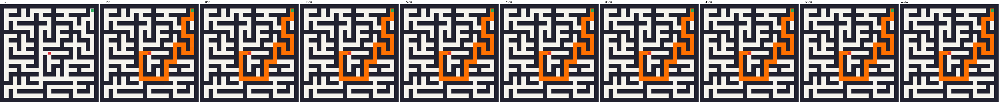

# unmaze

A diffusion model that solves **Overlook-style hedge mazes**. It starts from snow-static and denoises it into the path that connects the maze's entrance to its heart. It trains on a plain CPU, and there is a browser page that replays the *real* model's frames so you can watch it think.

<p align="center">
  
</p>

> **Inspired by** the hedge maze in Stanley Kubrick's *The Shining*. This is a fan homage built from colour, light and geometry. It uses no footage, stills, typography, music or maze plans from the film and is not affiliated with it.

**[Watch the 30-second film](docs/unmaze-demo.mp4)** &middot; **[Open the page](web/index.html)** (double-click it, nothing to install)

## Try it

```bash
pip install -e ".[dev]"            # PyTorch, NumPy, Pillow (+ pytest)

python -m unmaze solve --seed 3    # solve one held-out hedge maze, printed in the terminal
python -m unmaze eval              # solve rate on 200 held-out mazes
python -m unmaze demo --seed 3     # a PNG strip and GIF of the denoising

open web/index.html                # the cinematic replay (just open the file in a browser)
```

Train your own (CPU is fine; the shipped checkpoint took about 50 minutes on 3 CPU threads):

```bash
python -m unmaze train --maze-size 11 --steps 6000 --out runs/model.pt
python -m unmaze eval --checkpoint runs/model.pt
python -m unmaze export --checkpoint runs/model.pt --count 30     # refresh the page's data
```

`--maze-size` is cells per side and must be odd (the drawn grid is `2n+1` pixels).

## The page

`web/index.html` is plain HTML, CSS and JavaScript: no build step, no server, no network. It replays frames the real model produced (`python -m unmaze export` writes them), so what you see is what the model did, not an animation of it.

- **The model sees**: the noisy mask it is actually shown. It starts as pure snow.
- **The model guesses**: its current guess at the clean path. The red thread in the maze is the same guess, thicker where it is surer.
- **Noise / step / level**: how far along the denoising is.
- After the last step the strict judge's verdict appears (*SOLVED* or *LOST*, with the reason). Then a lantern walks the path out of the heart.
- Mazes the model got wrong are shown too (hollow red dots).

Keys: `Space` play/pause, `N` / `P` next / previous maze, `R` replay, `←` `→` scrub. It respects `prefers-reduced-motion`.

## Results

**99.8% solved (4,990 / 5,000; 95% CI 99.6% to 99.9%)** on 5,000 fresh 11×11 mazes the model never saw, 50 sampling steps, judged strictly with no repair. The shipped checkpoint is 2.7M parameters, trained 6,000 steps on 11×11 Overlook mazes (about 50 minutes on 3 CPU threads).

**Read that number with its limits** (the full audit, with the evidence, is in [`docs/eval-audit.md`](docs/eval-audit.md)):

- **It describes one kind of maze.** All training and test mazes come from the same generator (uniform random spanning trees). On depth-first-search mazes with long winding corridors, which the model never trained on, it solves **66%**.
- **Long routes are where it fails.** All 10 failures in the 5,000 were in the longest quarter of routes; on a stress set of the 300 longest routes of 30,000 it solves **93%**.
- **The sampler's noise moves the number by a few tenths of a percent.** The same 1,000 mazes score 993 to 999 under different sampler seeds, and the failures are about the noise, not the maze (13 mazes failed under some seed, none under all three).

Sampling steps (1,000 dev-range mazes; a different sampler seed shifts these by a few tenths of a percent):

| sampling steps | solve rate |
|---:|---:|
| 1 | 95.6% (93.6% on the fresh range) |
| 2 | 99.7% |
| 5 | 99.8% |
| 10 | 99.9% |
| 50 (default) | 99.9% (99.8% on the 5,000 fresh) |

One step already gets most mazes; iterating fixes small errors, and what is left is rare but large (a long stretch of the route lost).

Zero-shot on maze *sizes* it was not trained on (50 steps):

| maze | grid | solve rate | mazes |
|---|---|---:|---:|
| 7×7 | 15×15 | 99.7% | 300 |
| 9×9 | 19×19 | 99.7% | 300 |
| **11×11 (trained)** | 23×23 | 99.8% | 5,000 |
| 13×13 | 27×27 | 98.9% | 1,000 |
| 15×15 | 31×31 | 95.0% | 1,000 |

Reproduce with `python -m unmaze eval --count 1000` (it prints the interval). Use `--split test` for final numbers only. The 30 mazes in the page are the first 30 dev seeds, picked without looking at the results (all solved).

## How it works

1. **The puzzles.** Every puzzle is an *Overlook maze*: an odd-sized square perfect maze (uniformly random, via Wilson's algorithm) entered from a random cell on its outer ring, with the **heart** at the centre. The true solution comes from breadth-first search. Training generates fresh mazes every step, so the model cannot memorise; held-out mazes come from a seed range training never touches.
2. **Diffusion runs over the answer, not the maze.** The thing being noised is the *path mask*: a picture with the solution's pixels at +1 and everything else at −1. A small U-Net sees the noisy mask, three channels describing the puzzle (walls, entrance, heart) and the noise level, and predicts the clean mask. Self-attention at the two coarse resolutions lets it follow a corridor across the whole maze.
3. **Solving is denoising.** Starting from pure Gaussian noise, a deterministic DDIM sampler asks the model for its clean guess, steps a little less noisy, and repeats (50 steps by default). The final guess, thresholded at zero, is the answer.
<p align="center">
  
</p>

4. **The judge is strict.** An answer counts as *solved* only if its pixels are exactly one simple path from entrance to heart through open pixels. No gaps, no stray blobs, no wall crossings, and **no repair step** afterwards, because a clean-up pass would be doing the solving.

An honest note on what diffusion is doing here: a perfect maze has exactly one solution, so the "distribution" the model learns is a single point. It is not sampling among many valid paths; the noise mostly serves as an iterative-refinement scaffold. The numbers above show it: one step already gets most mazes, and a few more fix most of the rest. A maze with loops would make the generative part more interesting.

## The film

`scripts/render_film.py` renders the 30-second clip. The page's film mode is a *pure function of time*, so frames are captured one by one in headless Chromium (not screen-recorded), and re-running gives the same pictures; the test suite checks this. The sound is synthesised from the same timeline with NumPy (no samples, nobody's music).

```bash
pip install playwright                 # uses the Chromium it finds; see the script
python scripts/render_film.py --out docs/unmaze-demo.mp4
```

## Repo map

| | |
|---|---|
| `unmaze/maze.py` | the maze world: generate, solve (BFS), judge, encode, render |
| `unmaze/diffusion.py` | noise schedule and the Solver (DDIM sampler, replay; takes any denoiser) |
| `unmaze/model.py` | the U-Net denoiser |
| `unmaze/training.py` | training loop, checkpoints |
| `unmaze/evaluation.py` | the solve rate on held-out mazes |
| `unmaze/export.py` | writes the data file the page replays |
| `unmaze/viz.py` | PNG strip and GIF of the denoising |
| `web/` | the page: `index.html`, `style.css`, `js/`, bundled fonts (OFL / Apache 2.0) |
| `scripts/` | `render_film.py` and the audio synth |
| `docs/eval-audit.md` | what the evals say, and what they do not (an `eval-audit` run) |
| `GLOSSARY.md` | the project's vocabulary (overlook maze, entrance, heart, attempt, verdict, …) |
| `docs/adr/` | the decisions worth remembering, and why |
| `.scratch/` | the specs this was built from |

## Tests

```bash
pytest                # fast: no training beyond tiny configs
pytest -m slow        # the shipped checkpoint through the CLI, and the page in headless Chromium
```

The sampler is tested with an *oracle denoiser* that knows the answer: if the sampler and noise schedule are right, a perfect denoiser must lead to exactly the true solution, so any failure of a trained model is the model's, not the sampler's. The export is tested by decoding the file independently and comparing it with a fresh run of the model.

## How this was built

Built with [Matt Pocock's skills](https://github.com/mattpocock/skills): vocabulary first (`domain-modeling` → `GLOSSARY.md`, ADRs), then a spec with the test seams agreed up front (`to-spec`), then red-green TDD in vertical slices at those seams (`tdd`, `implement`), then a two-axis review against the spec and the coding standards (`code-review`). The evals were then audited with the [evals skills](https://github.com/ai-evals-course/evals-skills) (`evals-start` → `eval-audit`); see [`docs/eval-audit.md`](docs/eval-audit.md).

Fonts: [Jost](https://github.com/indestructible-type/Jost) (SIL OFL 1.1) and [Special Elite](https://fonts.google.com/specimen/Special+Elite) (Apache 2.0), bundled in `web/fonts` with their licences.
